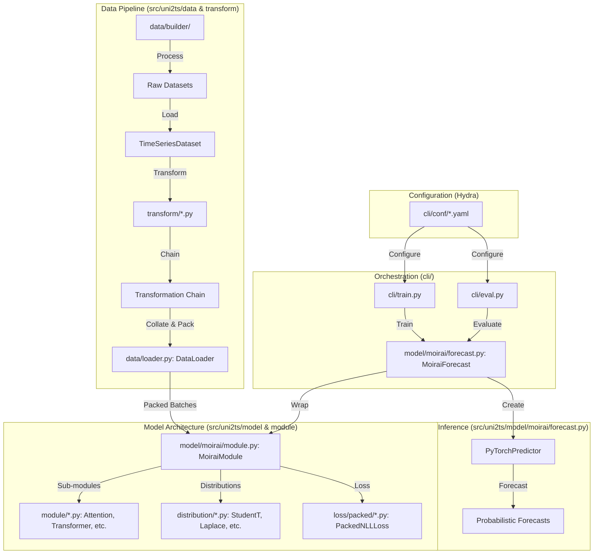

# MOIRAI Codebase Architecture Overview

This document provides a comprehensive overview of the MOIRAI architecture, its components, and their interconnections.

## **System Architecture**

The MOIRAI codebase follows a modular design that separates data processing, model architecture, training, and evaluation.

## **Core Components & Interconnections**

### 1. **Model Architecture (`src/uni2ts/model/moirai/`)**
- [`MoiraiModule`](../src/uni2ts/model/moirai/module.py): The core Transformer-based foundation model. It handles multi-patch size projections, rotary position embeddings (RoPE), and binary attention biases for variate handling.
- [`MoiraiForecast`](../src/uni2ts/model/moirai/forecast.py): A Lightning wrapper for `MoiraiModule` that integrates with GluonTS. It handles the logic for choosing patch sizes (auto-patch) and generating samples for probabilistic forecasting.

### 2. **Data Transformation Pipeline (`src/uni2ts/transform/`)**
- Uses a chainable transformation pattern ([`_base.py`](../src/uni2ts/transform/_base.py)).
- Key transforms include [`patch.py`](../src/uni2ts/transform/patch.py) for selecting and applying patch sizes and [`task.py`](../src/uni2ts/transform/task.py) for preparing the masked prediction task during training.

### 3. **Data Loading & Packing (`src/uni2ts/data/`)**
- [`loader.py`](../src/uni2ts/data/loader.py): Implements sequence packing, which packs multiple short time series into a single training sequence to minimize padding waste (reducing compute waste from ~60% to <1%).

### 4. **Distribution & Loss (`src/uni2ts/distribution/` & `src/uni2ts/loss/`)**
- Supports various parametric distributions (Normal, Student-T, Negative Binomial, etc.) to handle different data types (continuous, count, etc.).
- Loss functions are specialized for packed sequences ([`loss/packed/`](../src/uni2ts/loss/packed/)).

### 5. **CLI Orchestration (`cli/`)**
- [`train.py`](../cli/train.py): Uses Hydra and Lightning to manage large-scale pretraining and fine-tuning.
- [`eval.py`](../cli/eval.py): Provides a standardized interface for evaluating models on benchmarks like Monash or LOTSA.

## **Key Innovations**
- **Universal Multi-Patch Size:** Allows the model to adapt to different frequencies by using different patch sizes.
- **Sequence Packing:** Highly efficient training by packing variable-length sequences.
- **Any-Variate Attention:** Uses binary attention bias to handle any number of variates in a single sequence.
- **Probabilistic Foundation:** Built from the ground up to output distributions rather than point estimates.
