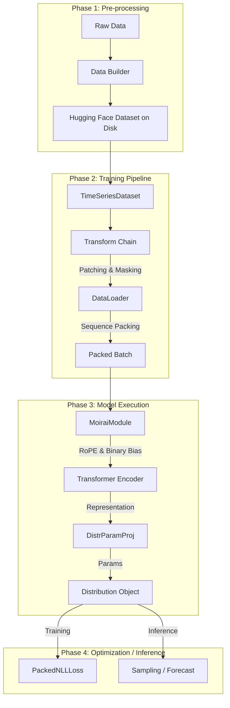

# `uni2ts`: Unified Time Series Forecasting Library

`uni2ts` is a comprehensive framework for training and deploying **Universal Time Series Foundation Models**. It implements the **MOIRAI** (Masked Encoder-based Universal Time Series Forecasting Transformer) architecture and provides a highly efficient pipeline for large-scale pretraining and fine-tuning on diverse time series data.

## **Core Architectural Philosophy**

The library is built on four pillars of "Universality":
1.  **Any-Frequency**: Handles yearly, monthly, daily, hourly, and even sub-second data through a flexible, multi-patch size projection mechanism.
2.  **Any-Variate**: Supports any number of variates in a single sequence using binary attention biases to capture inter-variate relationships.
3.  **Probabilistic**: Outputs parametric distributions or quantiles, providing a robust measure of uncertainty.
4.  **Foundation-First**: Designed for large-scale pretraining on billions of observations (LOTSA archive) with highly efficient sequence packing.

---

## **Library Structure & Component Map**

The library is organized into specialized modules, each handling a distinct part of the ML lifecycle:

### 1. **Data Infrastructure**
- **[`data/`](data/data.md)**: Core dataset and loader logic.
    - **Sequence Packing**: Implemented in `PackCollate`, it reduces compute waste by packing multiple short series into single training sequences.
    - **[`builder/`](data/builder/builder.md)**: Logic for downloading and converting raw data (CSV, GluonTS) into the unified Hugging Face format.
    - **[`indexer/`](data/indexer/indexer.md)**: High-performance data access leveraging PyArrow for sub-millisecond retrieval of time series windows.

### 2. **Preprocessing Pipeline**
- **[`transform/`](transform/transform.md)**: A fluent, chainable API for data preparation.
    - **Patching**: Dynamic selection of patch sizes based on frequency.
    - **Feature Engineering**: Automated addition of time indices and variate IDs.
    - **Masking**: Prepares the BERT-style masked prediction task for pretraining.

### 3. **Model Backbone**
- **[`model/`](model/model.md)**: Top-level model orchestration.
    - **[`moirai/`](model/moirai/moirai.md)**: The original MOIRAI Masked Encoder architecture.
    - **[`moirai_moe/`](model/moirai_moe/moirai_moe.md)**: Mixture-of-Experts variant for massive scale.
    - **[`moirai2/`](model/moirai2/moirai2.md)**: Second generation focusing on quantile regression.
- **[`module/`](module/module.md)**: Reusable Transformer components.
    - **Attention**: Grouped-query attention with variable-width support.
    - **[`position/`](module/position/position.md)**: Advanced Rotary Position Embeddings (RoPE) and Binary Attention Biases.
    - **Embeddings**: `MultiInSizeLinear` allows the model to "see" patches of different lengths in the same hidden dimension.

### 4. **Probabilistic Framework**
- **[`distribution/`](distribution/distribution.md)**: Mapping representation space to probabilistic parameters (Student-T, Negative Binomial, Mixture distributions, etc.).
- **[`loss/`](loss/loss.md)**: Specialized losses (NLL, CRPS, MSE) that correctly handle sequence packing and masking.

### 5. **Execution & Evaluation**
- **[`optim/`](optim/optim.md)**: Learning rate schedulers optimized for Transformer training (Cosine with restarts, warmup).
- **[`eval_util/`](eval_util/eval_util.md)**: Benchmarking framework integrated with GluonTS for zero-shot and in-distribution evaluation.
- **[`callbacks/`](callbacks/callbacks.md)**: Custom Lightning hooks for checkpointing and Hugging Face Hub synchronization.

---

## **Data Flow & Inter-connectivity**

The following diagram illustrates how a raw time series is processed into a forecast:

---

## **Key Innovations in `uni2ts`**

### **Multi-Patch Size Projection**
Instead of a fixed patch size, the library uses a bank of linear layers to project patches of size $P \in \{8, 16, 32, 64, 128\}$ into a shared $D_{model}$ space. This allows a single model to natively handle different time scales without resampling the data.

### **Sequence Packing**
Pretraining on billions of observations is made feasible by packing. By sorting sequences and using a first-fit decreasing bin packing strategy, the library achieves $>99\%$ hardware utilization, compared to $<40\%$ with standard padding.

### **Any-Variate Support**
Through the use of `BinaryAttentionBias`, the model treats multiple variates as separate tokens but allows them to attend to each other if they share the same variate ID or temporal context, enabling seamless zero-shot multivariate forecasting.

---

## **Usage Contexts**
- **Pretraining**: Use `cli/train.py` with `MoiraiPretrain`.
- **Fine-tuning**: Use `cli/train.py` with `MoiraiFinetune`.
- **Inference**: Use `MoiraiForecast` to wrap a model and integrate with standard forecasting tools.
